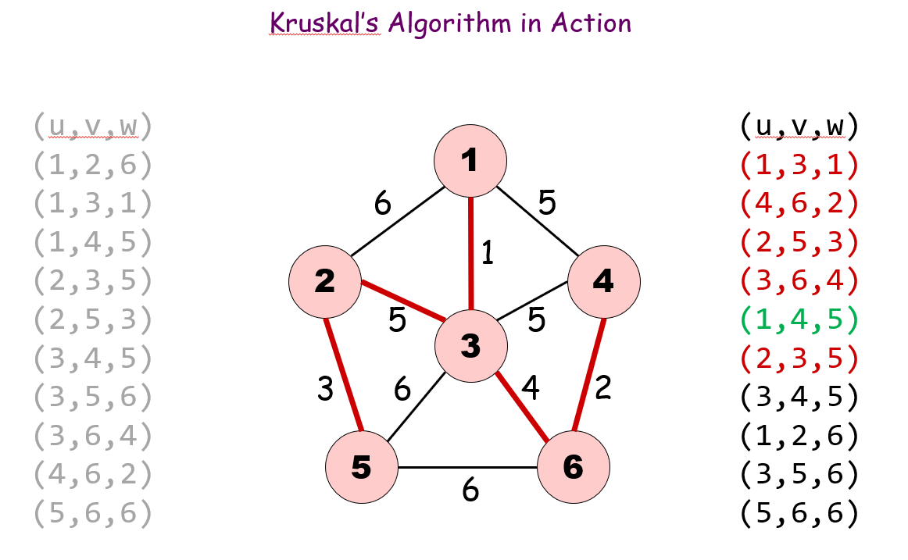
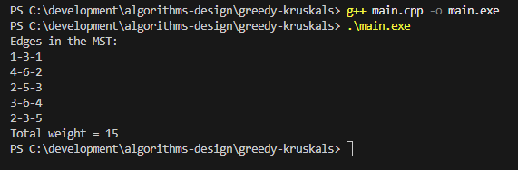

# greedy-kruskals
Kruskal's Algorithm 

## 1. Overview
Kruskal's Algorithm is a greedy algorithm used to find the minimum spanning tree (MST) of a connected, weighted, undirected graph. The MST connects all vertices in the graph with the minimum possible total edge weight while ensuring no cycles are formed. 

The algorithm works by sorting all edges in increasing order of weight and repeatedly adding the smallest edge that does not create a cycle. To efficiently detect cycles, the union-find (disjoint set) data structure is used. 

In the implementation, Kruskal's algorithm processes a graph with 6 vertices and selects edges that minimize the total cost of connecting all vertices. 


## 2. Problem 
Given a weighted, undirected graph with a set of vertices V and edges E, the goal is to construct a minimuym spanning tree. 

A MST must satisfy two condition, it connects all vertices in the graph and the total weight of the edges is minimized with no cycles. 

Kruskal's algorithm achieves this by greedily selecting the smallest available edge that does not form a cycle. 

## 3. Objectives
The objective of this program are:
* Implement Kruskal's greedy algorithm for computing a MST
* use the union-find data structure to detect cycles efficiently
* sort edges based on their weights
* select edges that connect disjoint sets of vertices
* compute and display the total weight of the MST

## 4. Input and Output
The program uses a predefined list of weighted edges where each line represents (u, v, weight). The program outputs the edges included in the MST and the total cost. 


#### Example:
* Input: [{1,2,6}, {1,3,1}, {1,4,5}, {2,3,5}, {2,5,3}, {3,4,5}, {3,5,6}, {3,6,4}, {4,6,2}, {5,6,6}]
* Output: 
Edges in the MST:
1-3-1
4-6-2
2-5-3
3-6-4
1-4-5
Total weight = 15

## 5. Algorithm / Approach
Kruskal's algorithm follows a greedy strategy:
* 1. Sort all edges in increasing order of weight
* 2. Initialize a disjoint set for each vertex
* 3. Process edges in sortred order
* 4. For each edge:
  * - check whether the endpoints belong to diffferent sets
  * - add the edge to MST if they do
  * - merge the sets containing those vertices
* 5. continue until n-1 edges have been added to the MST

This gurantees the minimum possibe spanning tree. 

## 6. Data Structures Used
#### Edge Structure
Stored the endpoints and weight of an edges.
```.cpp
struct Edge {
    int u;
    int v;
    int weight;
};
```
#### Vector
Vector is used to store graph edges, parent sets for union find and resulting MST edges
#### Disjoint Set
Is is used to eficiently detect cycles. findSet() and unionSet() are used. 

## 8. Time and Space Complexity
#### Time Complexity
Sorting edges is O(m log m) and Union-Find is O(m α(m,n)). SO, the overall time complexity is O(m log n).

#### Space Complexity
The total space complexity is O(n + m).


## 9. How to Compile and Run
#### To compile:
```bash
g++ main.cpp -o main.exe
```

#### Run:
```bash
.\main.exe
```

## 11. Program Screenshots


## 13. Challenges Faced
Some challenges I faced during implementation was handeling the vertex indexing and learning how the disjoint set functions worked. The graph uses vertices labeled from 1 to 6, while C++ cectors are 0-indexed causing an out of bound error when accessing the parent array. 


## 14. What I Learned
Through this project, I gained a deeper understanding of greedy algorithms and how they are applied to graph problems. I learned how Kruskal's algorithm builds a minimum spanning tree by always chossing the smallest safe edge. 

Additionally I learned how union find data structure helps efficiently detect cycles in a graph. 
